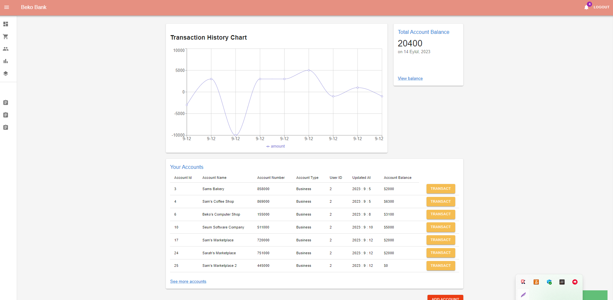
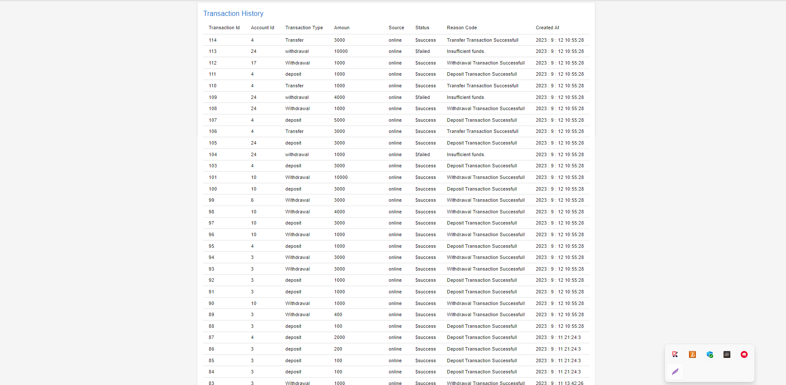

# NovaBank — Intelligent Digital Banking Platform

This repository contains the NovaBank frontend application for a modern digital banking platform. The frontend is built with React and Redux and connects to the NovaBank API backend.

The application is a single-page web client that uses React and Redux to maintain a responsive user experience. Every component is connected to the global Redux store, and state updates propagate automatically across the interface.

Users can register, log in, view their account history, open new accounts, make transfers between accounts, deposit money, withdraw money, and make payments. Additionally, a self-updating chart has been prepared for users to view their account flows. In short, the components are constantly in communication with the backend, ensuring seamless interaction.

This documentation covers the NovaBank frontend implementation and deployment steps. It is intended to help developers and stakeholders understand how the application is structured and connected to the NovaBank API backend.

## Project Images and Components







  
## Features

- React and Redux
- Single Page Application
- Material UI


  
## Distribution

1- Clone the project to your local machine.
2- Build and run the application using your preferred Java Script environment.

Start for Project

```terminal
  npm install
```

```bash
  npm run start
```

  
## Technologies

**Language:** JavaScript 

**Technologies:** React, Redux, React Router, Redux Thunk
  
## Extracted Lessons

React, Redux, Thunk usage. JavaScript experiences. Communication with backend. CORS Policy Setting. MUI usage. Frontend web development. JWT and cookies.
    
